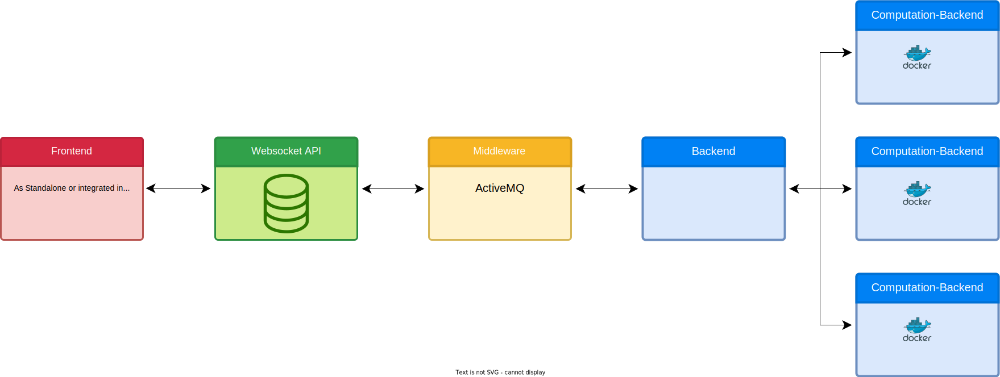

# Architecture

## General Architecture

<figure markdown>
  
  <figcaption>ViPLab Architecture: General Overview</figcaption>
</figure>

### Components

#### Frontend
The *ViPLab Frontend* is a browser-based web application. 
It was developed using the JavaScript Framework Vue.js. 
The user can enter his/her input using the graphical interface. 
If the user sends the input, a JSON message is generated and sent to the Websocket API.

An overview with descriptions of the Frontend can be found here: [ViPLab Frontend](../viplab-frontend/frontend.md).

!!! error "TODO"
    Publish Repo on GitHub and add Link to it

#### Websocket API

The *Websocket-Api* can be used by the clients to interact with ViPLab. 
For this it is necessary that th clients authenticate and autorize themselves using JSON Web Tokens (JWTs). 
Following this process, messages can be exchanged, to start a computation using ViPLab. 
To enable the computation, all necessary information has to be part of the Websocket message. 
The messages sent are JSON messages, which are partly described in the [Developer Guide](../viplab3.0/index.md). 
Once the result was computed, the client is informed. 

Additionally there is a Database, which is used to save Computations and their results. 
But it is no durable location for saving user data. 
The Backends have no access to this DB, so all relevant information has to be sent to the Backends using the Middleware. 

The Repository containing the code of the Websocket API can be found on [Git](https://github.com/VirtualProgrammingLab/viplab-websocket-api) and is written in Java. 

#### ECS

*ECS* (eLearning Community Server) is used as Middleware. 
It is used to decouple the calls from the *API* to enable asynchronous processing in the *Backends*. 
*ECS* is only used for asynchronous communication, not as Database. 
Only the Backends and the API have access to it. 

The code can be found [here](https://git.freeit.de/ecs4).

#### Backend

The ViPLab *Backend* is based on Python. 
It is used to evaluate the input made using the Frontend. 
For this the specified code or Docker-Container is executed and the result is reported back to the client via the Websocket API.

The code can be found [here](https://github.com/VirtualProgrammingLab/ViPLab-Backend).

## Using ILIAS

<figure markdown>
  
  <figcaption>ViPLab Architecture: ILIAS Plugin</figcaption>
</figure>

### Additional Components

#### ILIAS Plugin

!!! error "TODO"
    Should the ILIAS Plugin be described, too?

#### Correction Server
The *Correction Server* is responsible for the correction of exercises. 

Click [here](https://git.freeit.de/vipeval) to find the code and more information. 

## Using a Research Management Software (like DaRUS)

<figure markdown>
  
  <figcaption>ViPLab Architecture: Integration into DaRUS</figcaption>
</figure>

### Additional Components

#### DaRUS-ViPLab Extension: ViPLab-Connector - Integration into DaRUS

!!! error "TODO"
    Should the Extension be described here?

Landingpage out of DaRUS. 
It communicates with the Websocket API and starts the Frontend.
